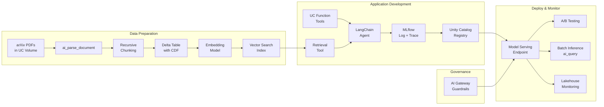

# Databricks GenAI Lab Guide

Hands-on guide for the Databricks Generative AI Engineer Associate certification. 10 original labs with Jupyter notebooks, architecture diagrams, cost estimates, and exam tips.

## Who This Is For

- Preparing for the Databricks Generative AI Engineer Associate exam
- Have a Databricks pay-as-you-go workspace (Community Edition is NOT sufficient)
- Comfortable with Python and basic SQL

## Quick Start

1. Clone this repo: `git clone https://github.com/btriani/databricks-genai-lab-guide.git`
2. Run the prerequisites check: `./scripts/check-prerequisites.sh`
3. Set up your Databricks catalog: `python scripts/setup-catalog.py`
4. Start with [Lab 01](labs/01-document-parsing-chunking/workbook.md)

## Labs

| # | Lab | Exam Domain (Weight) | Est. Cost | Est. Time |
|---|-----|---------------------|-----------|-----------|
| 01 | [Document Parsing & Chunking](labs/01-document-parsing-chunking/workbook.md) | Data Preparation (14%) | ~$1-2 | 30 min |
| 02 | [Vector Search & Retrieval](labs/02-vector-search-retrieval/workbook.md) | Data Preparation (14%) | ~$2-3 | 30 min |
| 03 | [Building a Retrieval Agent](labs/03-building-retrieval-agent/workbook.md) | Application Dev (30%) | ~$1-2 | 30 min |
| 04 | [UC Functions as Agent Tools](labs/04-uc-functions-agent-tools/workbook.md) | Application Dev (30%) | ~$1-2 | 25 min |
| 05 | [Single Agent with LangChain](labs/05-single-agent-langchain/workbook.md) | Application Dev (30%) | ~$1-2 | 35 min |
| 06 | [Tracing & Reproducible Agents](labs/06-tracing-reproducible-agents/workbook.md) | Application Dev (30%) | ~$1 | 25 min |
| 07 | [Guardrails & Governance](labs/07-guardrails-governance/workbook.md) | Governance (8%) | ~$1-2 | 30 min |
| 08 | [Evaluation & LLM-as-Judge](labs/08-evaluation-llm-judge/workbook.md) | Evaluation & Monitoring (12%) | ~$2-3 | 40 min |
| 09 | [Deployment & Model Serving](labs/09-deployment-model-serving/workbook.md) | Assembling & Deploying (22%) | ~$3-5 | 45 min |
| 10 | [Monitoring & Observability](labs/10-monitoring-observability/workbook.md) | Evaluation & Monitoring (12%) | ~$2-3 | 30 min |

**Total estimated cost: ~$15-25** | **Total time: ~5-6 hours**

See [COST-GUIDE.md](COST-GUIDE.md) for per-service pricing and how to minimize spend.

## Exam Domain Coverage

| Domain | Weight | Labs |
|--------|--------|------|
| Application Development | 30% | Lab 03, 04, 05, 06 |
| Assembling and Deploying Apps | 22% | Lab 09 |
| Data Preparation | 14% | Lab 01, 02 |
| Design Applications | 14% | Exam tips in every workbook |
| Evaluation and Monitoring | 12% | Lab 08, 10 |
| Governance | 8% | Lab 07 |

## Architecture Overview

## Each Lab Contains

- **`notebook.ipynb`** — Executable Jupyter notebook, runs directly on Databricks
- **`workbook.md`** — Architecture diagram, step-by-step walkthrough, exam tips, cost breakdown

## Sample Data

All labs use open-access arXiv AI/ML papers as sample data. Papers are **downloaded automatically** by the setup script — not bundled in this repo (see [assets/arxiv-papers/README.md](assets/arxiv-papers/README.md) for the full list and licenses).

Includes: Attention Is All You Need, BERT, RAG, LoRA, Chain-of-Thought, LLaMA, Constitutional AI, and Toolformer.

## Cheatsheets

- [RAG Pipeline Cheatsheet](cheatsheets/rag-pipeline-cheatsheet.md) — Parsing, chunking, embeddings, Vector Search
- [Agent Framework Cheatsheet](cheatsheets/agent-framework-cheatsheet.md) — MLflow, LangChain, UC functions, serving, monitoring

## Scripts

| Script | Purpose |
|--------|---------|
| `scripts/check-prerequisites.sh` | Verify all tools are installed |
| `scripts/setup-catalog.py` | Create Unity Catalog objects and upload papers |
| `scripts/cleanup.py` | Delete all Databricks resources when done |

## Official Databricks Resources

- [Generative AI Engineer Associate Exam Page](https://www.databricks.com/learn/certification/generative-ai-engineer-associate)
- [Databricks GenAI Documentation](https://docs.databricks.com/en/generative-ai/index.html)
- [MLflow Documentation](https://mlflow.org/docs/latest/index.html)
- [LangChain + Databricks](https://python.langchain.com/docs/integrations/providers/databricks/)

## Contributing

Found an error or have a suggestion? Open an issue or PR.

## License

[MIT](LICENSE)
