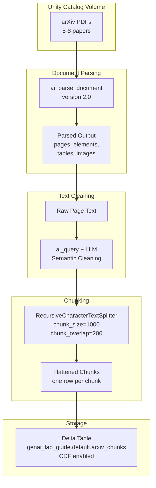

# Lab 01: Document Parsing & Chunking

## Architecture Diagram

**Estimated time:** ~30 min
**Estimated cost:** ~$1-2 (parsing + LLM cleaning tokens)

## What Was Done

### Step 1: Read PDFs from Unity Catalog Volume

- **What:** Used `spark.read.format("binaryFile")` to load all PDFs from the volume as binary data.
- **Why:** Databricks' `binaryFile` format reads files as raw bytes, which `ai_parse_document` requires as input. The volume stores our arXiv papers uploaded during setup.
- **Result:** DataFrame with one row per PDF, containing `path`, `content` (binary), and `length`.
- **Exam tip:** Know that documents for RAG must be stored in a Unity Catalog Volume before parsing.

### Step 2: Parse Documents with ai_parse_document()

- **What:** Applied `ai_parse_document()` to each document, both via Python (`expr()`) and SQL.
- **Why:** This function uses Mosaic AI to extract structured content (text, tables, images) from unstructured files. It handles complex layouts like multi-column PDFs and embedded figures.
- **Result:** Each row gains a `parsed_content` struct with `document.pages`, `document.elements`, `error_status`, and `metadata`.
- **Exam tip:** `ai_parse_document()` is a SQL function — in Python, you call it via `expr()`. It supports PDF, PNG, JPEG, and TIFF formats.

### Step 3: Clean Parsed Text with ai_query()

- **What:** Concatenated page text per document, then used `ai_query()` with a Foundation Model to semantically clean the text.
- **Why:** Raw parsed text often has broken lines, orphaned headers, and page number artifacts. LLM-based cleaning preserves meaning while removing noise. This is the higher-quality (but higher-cost) approach compared to simple string concatenation.
- **Result:** Clean, well-structured text per document.
- **Exam tip:** The exam tests the trade-off: `ai_query()` cleaning = higher quality, higher cost. Simple concatenation with Spark UDF = lower quality, lower cost.

### Step 4: Chunk Documents

- **What:** Used `RecursiveCharacterTextSplitter` from LangChain with `chunk_size=1000` and `chunk_overlap=200`.
- **Why:** Chunks must be small enough for meaningful embedding similarity but large enough to contain useful context. Recursive splitting tries paragraph boundaries first, preserving semantic coherence. Overlap prevents context loss at chunk boundaries.
- **Result:** Flattened DataFrame with one row per chunk, each with a unique `chunk_id` (SHA-256 hash of path + index).
- **Exam tip:** Increasing chunk size reduces the number of embeddings (good for storage limits) but makes retrieval less precise. Increasing overlap improves boundary handling but increases total chunks.

### Step 5: Save to Delta Table with Change Data Feed

- **What:** Wrote chunks to `genai_lab_guide.default.arxiv_chunks` with `delta.enableChangeDataFeed=true`.
- **Why:** Vector Search Delta Sync requires a unique primary key per row and Change Data Feed (CDF) enabled. CDF tracks row-level changes so the index can sync incrementally.
- **Result:** Delta table with columns: `chunk_id`, `path`, `chunk_index`, `chunk_text`.
- **Exam tip:** The two prerequisites for Delta Sync Vector Search are: (1) unique primary key column, (2) Change Data Feed enabled on the source table.

## Key Concepts

| Concept | Definition |
|---------|-----------|
| `ai_parse_document()` | Databricks SQL function that extracts text, tables, and images from documents using Mosaic AI |
| `ai_query()` | Databricks SQL function that invokes a Foundation Model endpoint for inference within SQL |
| Recursive Character Splitting | Chunking strategy that tries to split on semantic boundaries (paragraphs > sentences > words) |
| Chunk Overlap | Shared text between adjacent chunks to prevent context loss at boundaries |
| Change Data Feed (CDF) | Delta Lake feature that tracks row-level changes, required for Delta Sync Vector Search |
| Unity Catalog Volume | Managed storage for non-tabular files (PDFs, images, CSVs) within Unity Catalog |

## Common Exam Question Patterns

1. **"Which function parses documents in Databricks?"** → `ai_parse_document()`. Not `ai_query()` (that's for model inference), not `Unstructured` (that's a Python library for local use).

2. **"What are the prerequisites for creating a Delta Sync Vector Search index?"** → Unique primary key column + Change Data Feed enabled on the source Delta table.

3. **"Which cleaning approach has higher quality but higher cost?"** → `ai_query()` with an LLM for semantic cleaning (vs. simple Spark UDF concatenation).

4. **"A vector database can only store 100M embeddings but chunking produces 150M. How to reduce?"** → Increase chunk size → fewer chunks per document → fewer embeddings.

5. **"Why is chunk overlap used?"** → Prevents context from being lost at chunk boundaries. Improves retrieval quality for content spanning adjacent chunks.

## Cost Breakdown

| Resource | Usage | Est. Cost |
|----------|-------|-----------|
| Serverless Compute | ~15 min notebook execution | ~$0.50 |
| ai_parse_document | 5-8 PDFs, ~50 pages total | ~$0.25-0.50 |
| ai_query (LLM cleaning) | ~50K tokens input + output | ~$0.25-0.50 |
| Delta Storage | ~5MB chunks table | ~$0.01 |
| **Total** | | **~$1-2** |
