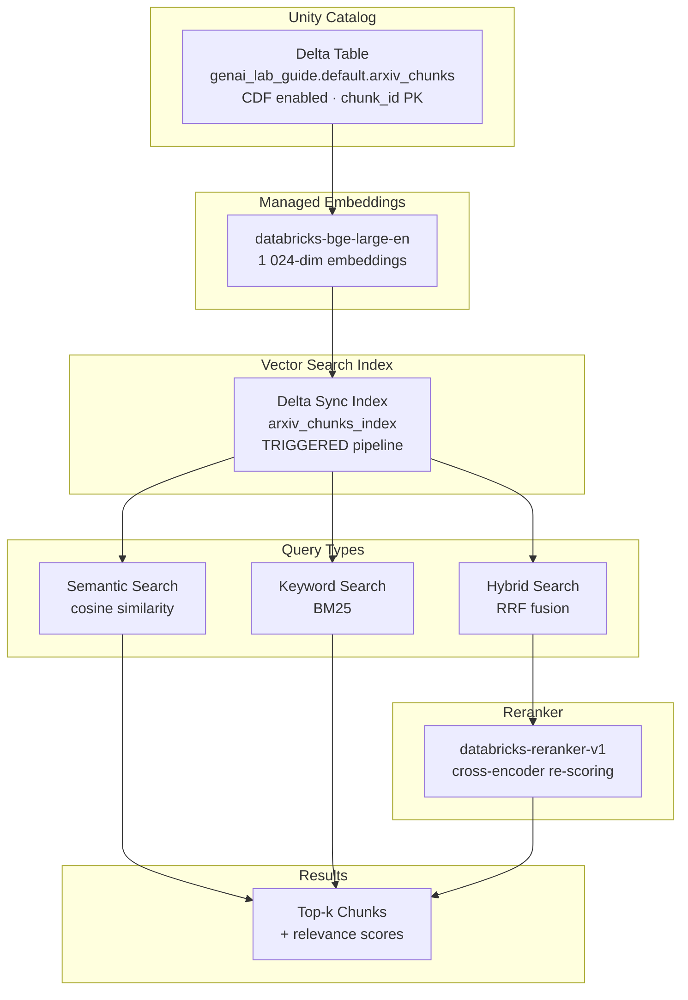

# Lab 02: Vector Search & Retrieval

## Architecture Diagram

**Estimated time:** ~30 min
**Estimated cost:** ~$2-3 (endpoint compute + managed embeddings + VS queries)

## What Was Done

### Step 1: Create a Vector Search Endpoint

- **What:** Provisioned a `STANDARD` endpoint named `genai_lab_guide_vs_endpoint`
  using `VectorSearchClient.create_endpoint()`, then waited for it to reach `READY`
  state with `wait_get_endpoint_ready()`.
- **Why:** An endpoint is the compute layer that hosts Vector Search indexes and
  handles query traffic.  It must exist before any index can be created beneath it.
  A single endpoint can serve multiple indexes, so it is a shared resource within
  a workspace.
- **Result:** A running endpoint visible in the Databricks UI under
  Catalog > Vector Search.
- **Exam tip:** Know the dependency order — **endpoint before index**.  Also know
  that `STANDARD` endpoints autoscale; `OPTIMIZED` endpoints offer lower latency
  at higher cost.

### Step 2: Create a Delta Sync Index with Managed Embeddings

- **What:** Called `create_delta_sync_index()` with `embedding_source_column="chunk_text"`
  and `embedding_model_endpoint_name="databricks-bge-large-en"`.  Set
  `pipeline_type="TRIGGERED"` for on-demand sync, then waited with
  `index.wait_until_ready()`.
- **Why:** Delta Sync indexes automatically track changes in the source Delta table
  via Change Data Feed (CDF).  Managed Embeddings mean Databricks generates and
  stores the vector embeddings — you never call the embedding model directly.
  This simplifies the pipeline and eliminates embedding drift.
- **Result:** A queryable index with 1 024-dimensional embeddings, auto-synced to
  `arxiv_chunks`.
- **Exam tip:** Two hard prerequisites for Delta Sync: (1) unique primary key
  (`chunk_id`), (2) `delta.enableChangeDataFeed = true`.  Both were set in Lab 01.

### Step 3: Query with Three Search Types

- **What:** Queried the index using `similarity_search()` with
  `query_type="ann"` (default semantic), `"keyword"`, and `"hybrid"`.
- **Why:** Different query types serve different use cases.  Semantic search
  excels with paraphrased or conceptual queries; keyword (BM25) excels with
  exact technical terms; hybrid combines both via Reciprocal Rank Fusion (RRF)
  and is the recommended default for production RAG.
- **Result:** Top-5 ranked chunks per query type, with relevance scores and source
  file paths printed for comparison.
- **Exam tip:** The exam often asks "which query type should be used when…".
  Semantic = natural language; keyword = acronyms / exact terms; hybrid = default
  / mixed workloads.

### Step 4: Apply a Reranker

- **What:** Added `query_vector_search_config={"reranker": {"reranker_model_endpoint_name": "databricks-reranker-v1"}}`
  to a hybrid search call.
- **Why:** A reranker is a cross-encoder that scores each (query, candidate) pair
  jointly — far more accurate than bi-encoder similarity alone.  It runs on the
  small candidate set returned by retrieval, so the extra cost is manageable while
  precision improves significantly.
- **Result:** Candidates reordered by cross-encoder relevance scores, typically
  surfacing more on-topic chunks in position 1–3.
- **Exam tip:** A reranker **reorders existing candidates** — it does **not** add
  new documents.  If top-k quality is poor, first check retrieval breadth (increase
  `num_results`) before blaming the reranker.

### Step 5: Compare Embedding Models

- **What:** Reviewed the trade-offs between `databricks-bge-large-en` (1 024 dim,
  0.44 GB) and `databricks-bge-small-en` (384 dim, 0.13 GB).
- **Why:** Embedding model selection affects storage cost, query latency, and
  retrieval quality.  Larger models capture richer semantics but cost more to run.
  This decision is made once at index creation — changing it requires rebuilding
  the entire index.
- **Result:** Concrete decision framework: prefer `bge-large` when quality matters;
  prefer `bge-small` for high-volume or cost-sensitive pipelines.
- **Exam tip:** Know dimension sizes: `bge-large` = 1 024, `bge-small` = 384.
  Larger dimension ≠ always better — oversized embeddings for simple corpora waste
  compute and storage.

## Key Concepts

| Concept | Definition |
|---------|-----------|
| VS Endpoint | Compute resource that hosts and serves Vector Search indexes; must be created before any index |
| Delta Sync Index | Index type that auto-syncs with a source Delta table using CDF; supports managed and self-managed embeddings |
| Managed Embeddings | Databricks handles embedding generation using a specified model endpoint — no user code needed |
| Semantic Search | ANN-based retrieval using cosine similarity between query and document embeddings |
| Keyword Search (BM25) | Term-frequency ranking algorithm; effective for exact technical terms and acronyms |
| Hybrid Search | Combines semantic + keyword results via Reciprocal Rank Fusion (RRF); recommended default for RAG |
| Reranker | Cross-encoder model that re-scores a candidate set for higher precision; does not expand the candidate pool |

## Common Exam Question Patterns

1. **"What are the prerequisites for creating a Delta Sync Vector Search index?"**
   → Unique primary key column + Change Data Feed (`delta.enableChangeDataFeed = true`)
   on the source Delta table.  Both must be set before calling `create_delta_sync_index()`.

2. **"When should you use hybrid search instead of semantic or keyword search?"**
   → When queries are unpredictable or mix natural language with specific technical
   terms.  Hybrid (RRF) is the recommended default for production RAG pipelines.

3. **"A reranker improves result quality, but which documents does it consider?"**
   → Only the candidates already returned by retrieval.  A reranker reorders —
   it never adds new documents from outside the initial result set.

4. **"Which embedding model should you choose for a cost-sensitive, high-volume pipeline?"**
   → `databricks-bge-small-en` (384 dim, 0.13 GB) — lower compute and storage cost
   at the expense of some retrieval quality vs. `bge-large`.

5. **"A user queries for 'GPU memory optimization techniques' but only gets results
   mentioning 'VRAM'.  Which search type would help most?"**
   → Semantic search — it captures conceptual similarity and will match "VRAM"
   as semantically related to "GPU memory", unlike keyword (BM25) which requires
   exact term overlap.

## Cost Breakdown

| Resource | Usage | Est. Cost |
|----------|-------|-----------|
| Serverless Compute | ~20 min notebook execution | ~$0.50 |
| Managed Embeddings | Embedding all chunks on index creation | ~$0.50 |
| VS Endpoint | Running during lab (~10 min active) | ~$1.00 |
| VS Queries | ~15 similarity_search calls | ~$0.10 |
| Reranker inference | ~5 reranked calls × 20 candidates | ~$0.10 |
| **Total** | | **~$2-3** |
