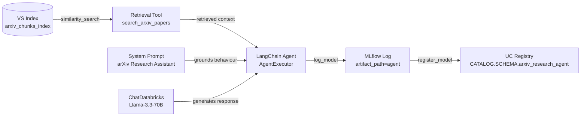

# Lab 03 Workbook: Building a Retrieval Agent

**Exam Domain:** Application Development (30%)
**Time:** ~30 minutes | **Cost:** ~$1–2

---

## Architecture Diagram

---

## Time and Cost

| Resource | Estimated Cost |
|---|---|
| Databricks Serverless compute | ~$0.50 |
| LLM token usage (test + logging) | ~$0.50 |
| **Total** | **~$1–2** |

---

## What Was Done

### Step 1 — Build the Retrieval Function

**What:** Wrote `retrieve_context()` which calls `index.similarity_search()` on the Vector Search index using `query_type="hybrid"` and returns a single formatted string of passages.

**Why:** Hybrid retrieval (dense embeddings + sparse BM25) outperforms either method alone, especially for technical vocabulary. Returning plain text avoids serialisation friction downstream.

**Result:** A callable function that accepts a query string and returns ranked, source-labelled context passages ready for LLM consumption.

**Exam tip:** Know the `similarity_search` parameters — `query_text`, `columns`, `num_results`, and `query_type` (`ann` | `hybrid`).

---

### Step 2 — Create the LangChain Agent

**What:** Decorated `retrieve_context` with `@tool` to create `search_arxiv_papers`, built a `ChatPromptTemplate` with a system message and `MessagesPlaceholder`, then wired everything together with `create_tool_calling_agent` and `AgentExecutor`.

**Why:** The tool-calling agent pattern lets the LLM decide autonomously when retrieval is needed — unlike a hard-coded chain, the agent can skip retrieval if the question is already in its parametric knowledge, or call the tool multiple times for complex queries.

**Result:** A working `AgentExecutor` that orchestrates multi-step reasoning with access to the Vector Search index.

**Exam tip:** Distinguish **agent** (dynamic tool selection) from **chain** (fixed sequence of steps). Use agents when the retrieval decision is conditional.

---

### Step 3 — Test the Agent

**What:** Invoked `agent_executor.invoke()` on two representative research questions: one about attention mechanisms, one about LoRA fine-tuning.

**Why:** End-to-end testing validates that retrieval, context injection, and generation all work together before logging a model version.

**Result:** Both queries returned grounded answers citing source document identifiers from the arXiv corpus.

**Exam tip:** Always test before logging — MLflow run metadata captures parameter values but not whether the outputs were correct.

---

### Step 4 — Log with MLflow

**What:** Called `mlflow.set_experiment()`, ran the agent on a sample input, used `infer_signature()` to capture the I/O schema, then logged the model with `mlflow.langchain.log_model()` inside `mlflow.start_run()`.

**Why:** Logging produces a versioned, reproducible artifact. The **model signature** is required by Model Serving to validate request payloads at inference time.

**Result:** An MLflow run with logged parameters, a model artifact at `runs:/<run_id>/agent`, and an inferred input/output signature.

**Exam tip:** `infer_signature(model_input, model_output)` — both arguments required. The signature enforces schema on the serving endpoint.

---

### Step 5 — Register in Unity Catalog

**What:** Set `mlflow.set_registry_uri("databricks-uc")`, then called `mlflow.register_model(model_uri=..., name="CATALOG.SCHEMA.arxiv_research_agent")`.

**Why:** UC registration unlocks Model Serving deployment, lineage tracking, and governance controls (ACLs, column masks). The three-part name (`catalog.schema.model`) is the UC standard.

**Result:** A registered model version visible in the Unity Catalog Explorer, ready to be served or promoted to a champion/challenger alias.

**Exam tip:** Always call `set_registry_uri("databricks-uc")` before `register_model`. Without it, the model lands in the legacy Workspace Registry, not Unity Catalog.

---

## Key Concepts

| Concept | Definition |
|---|---|
| **RAG (Retrieval-Augmented Generation)** | Architecture that retrieves relevant documents and injects them into the prompt before generation, grounding the LLM in external knowledge |
| **Retrieval Tool** | A Python function decorated with `@tool` that the LangChain agent can invoke to fetch context from a data source |
| **ChatDatabricks** | LangChain-compatible wrapper for Databricks Foundation Model API endpoints (e.g., Llama-3.3-70B) |
| **Tool Calling Agent** | Agent created via `create_tool_calling_agent` — the LLM uses function-calling to select and invoke tools dynamically |
| **AgentExecutor** | LangChain runtime that manages the agent loop: observe → think → act → repeat until a final answer is produced |
| **MLflow Model Signature** | Schema object (`infer_signature`) that defines expected input columns/types and output format; enforced at serving time |
| **Unity Catalog Model Registry** | Databricks-native model registry that integrates with UC governance; accessed via `mlflow.set_registry_uri("databricks-uc")` |

---

## Exam Practice Questions

**Q1.** What is the correct order of steps in a RAG pipeline?

- A) Generate → Retrieve → Augment
- B) Retrieve → Augment → Generate
- C) Augment → Retrieve → Generate
- D) Generate → Augment → Retrieve

**Answer: B** — Retrieve relevant documents first, augment the prompt with that context, then generate the response.

---

**Q2.** When should you use a LangChain **agent** instead of a simple **chain** for RAG?

- A) When retrieval always happens exactly once per query
- B) When the model should decide dynamically whether and how many times to retrieve
- C) When you want faster inference with fewer API calls
- D) When the prompt template has no placeholders

**Answer: B** — Agents are appropriate when the retrieval decision is conditional or when multi-hop retrieval may be needed.

---

**Q3.** Which MLflow function captures the input and output schema of a model for use with Model Serving?

- A) `mlflow.log_params()`
- B) `mlflow.langchain.log_model()`
- C) `infer_signature(model_input, model_output)`
- D) `mlflow.set_experiment()`

**Answer: C** — `infer_signature` inspects a sample input/output pair and returns a `ModelSignature` object that is passed to `log_model`.

---

**Q4.** What must you call before `mlflow.register_model()` to ensure the model is registered in Unity Catalog rather than the legacy Workspace Registry?

- A) `mlflow.set_tracking_uri("databricks")`
- B) `mlflow.set_registry_uri("databricks-uc")`
- C) `mlflow.enable_system_metrics_logging()`
- D) `mlflow.autolog()`

**Answer: B** — `mlflow.set_registry_uri("databricks-uc")` redirects `register_model` to Unity Catalog.

---

**Q5.** What is the purpose of the **system prompt** in the RAG agent configuration?

- A) To define the tool schemas the agent can call
- B) To set the maximum number of retrieval results
- C) To instruct the model on its persona, constraints, and when to use the retrieval tool
- D) To configure the MLflow experiment name

**Answer: C** — The system prompt shapes the agent's behaviour: persona ("arXiv Research Assistant"), constraints ("always retrieve before answering"), and citation format.

---

## Cost Breakdown

| Component | Detail | Estimated Cost |
|---|---|---|
| Databricks Serverless compute | Cluster startup + notebook execution (~20 min DBU) | ~$0.50 |
| LLM token usage | Test queries + sample inference for MLflow signature | ~$0.50 |
| Vector Search queries | Similarity search calls during testing and logging | Included in serverless |
| **Total** | | **~$1–2** |

> Costs vary by workspace region and current DBU pricing. Use the Databricks Cost Dashboard to track actuals.
