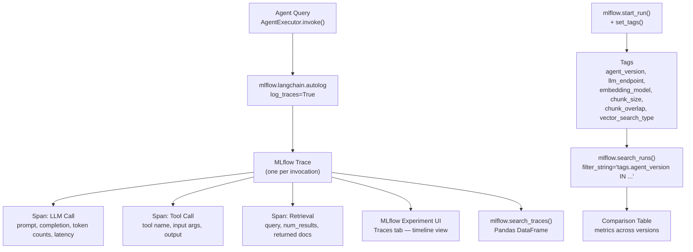

# Lab 06 Workbook: Tracing & Reproducible Agents

**Exam Domain:** Application Development (30%)
**Time:** ~25 minutes | **Cost:** ~$1

---

## Architecture Diagram

---

## Time and Cost

| Resource | Estimated Cost |
|---|---|
| Databricks Serverless compute | ~$0.50 |
| LLM token usage (agent queries + eval calls) | ~$0.50 |
| **Total** | **~$1** |

---

## What Was Done

### Step 1 — Enable Tracing

**What:** Called `mlflow.langchain.autolog(log_traces=True, log_models=False)` and `mlflow.set_experiment()` with a personal `/Users/<username>/...` path before running any agent queries.

**Why:** Autologging intercepts LangChain callbacks and converts every agent invocation into a structured trace without any changes to the agent code. A personal experiment path avoids permission conflicts in shared workspaces.

**Result:** Every subsequent `agent_executor.invoke()` call emits a trace to the MLflow Experiment UI automatically. The `Traces` tab shows all invocations with their span trees.

**Exam tip:** `mlflow.langchain.autolog(log_traces=True)` is a **single-call enablement** — the exam tests that you know this call is sufficient. No manual span instrumentation is needed for standard LangChain agents.

---

### Step 2 — Run Queries and Inspect in UI

**What:** Invoked `agent_executor.invoke()` for three queries — a retrieval query, a citation query, and a metadata query — and directed students to the MLflow Experiment UI Traces tab.

**Why:** Running diverse queries produces traces with different span structures: a retrieval query produces LLM call + retrieval + LLM call spans; a citation query produces LLM call + tool call spans; a metadata query produces LLM call + tool call spans. Comparing these span trees builds intuition for how the agent's reasoning loop works.

**Result:** Three traces appear in the Experiment UI, each with a distinct span tree reflecting the tools the agent chose to invoke.

**Exam tip:** In the Experiment UI, traces live under the **Traces tab** (separate from the Runs tab). The exam may ask where to find traces — it is not the Runs tab.

---

### Step 3 — Inspect Traces Programmatically

**What:** Called `mlflow.search_traces(experiment_names=[...], max_results=10, order_by=["timestamp_ms DESC"])` to retrieve a Pandas DataFrame of recent traces. Displayed `request_id`, `execution_duration`, `status`, `request`, and `response` columns. Iterated over the `spans` list of the most recent trace to print each span's name, duration, and status.

**Why:** Programmatic trace inspection enables automated quality gates — for example, flagging any trace where total `execution_duration` exceeds an SLA threshold, or where a span has `status=ERROR`. This is the foundation for latency monitoring in Lab 10.

**Result:** A DataFrame with one row per trace and a span-level printout showing the name and wall-clock time of every operation in the most recent agent invocation.

**Exam tip:** `mlflow.search_traces()` returns a DataFrame where the `spans` column contains a list of span dictionaries. `mlflow.search_runs()` is a different function that queries logged runs — know which to use for traces vs run metrics.

---

### Step 4 — Tag Experiments for Reproducibility

**What:** Wrapped an evaluation query in `mlflow.start_run()` and called `mlflow.set_tags()` with six keys: `agent_version`, `llm_endpoint`, `embedding_model`, `chunk_size`, `chunk_overlap`, `vector_search_type`. Also logged numeric parameters with `mlflow.log_params()` and a proxy quality metric with `mlflow.log_metric()`.

**Why:** A run without tags can never be fully reproduced — you cannot know which LLM, embedding model, or chunking configuration produced it. Tagging every run with the full configuration is the minimum standard for production agent experiments. Tags are mutable and can be queried with `filter_string` syntax.

**Result:** A run in the MLflow Experiment with six tags, five params, and one metric, fully describing the agent configuration for that invocation.

**Exam tip:** **Tags vs params**: tags are mutable key-value strings you can update after the run; params are write-once and immutable. Use tags for version labels and configuration identifiers; use params for numeric experiment knobs like `chunk_size`.

---

### Step 5 — Compare Agent Versions

**What:** Created a second simulated run (`v2`) with `chunk_size=256` and `chunk_overlap=32`, then called `mlflow.search_runs(filter_string="tags.agent_version IN ('v1', 'v2')")` to retrieve both runs into a single DataFrame. Built a comparison table with `agent_version`, `chunk_size`, `chunk_overlap`, `vs_type`, and `answer_length_chars` columns.

**Why:** Systematic version comparison is how teams decide which agent configuration to promote. In Lab 08, `answer_length_chars` is replaced by LLM-judge faithfulness and relevance scores. The `search_runs` + tag filter pattern is identical regardless of the metric being compared.

**Result:** A two-row comparison DataFrame showing the configuration delta between `v1` and `v2` alongside the metric difference, providing a template for production A/B evaluation.

**Exam tip:** `mlflow.search_runs(filter_string="tags.agent_version = 'v1'")` is the standard pattern for pulling all runs of a specific version. The `filter_string` uses SQL-like syntax — the exam tests that you can write a correct tag filter.

---

## Key Concepts

| Concept | Definition |
|---|---|
| **Trace** | The complete end-to-end record of one agent invocation — a tree of spans with a single root span representing the top-level call |
| **Span** | One unit of work within a trace: an LLM call, a tool invocation, or a retrieval step, each with start time, end time, inputs, and outputs |
| **Autologging** | `mlflow.langchain.autolog(log_traces=True)` — a single call that instruments all LangChain chains and agents to emit traces without code changes |
| **MLflow Experiment** | A named container for runs and traces, identified by a workspace path; set with `mlflow.set_experiment()` |
| **Experiment Tags** | Mutable key-value metadata attached to a run via `mlflow.set_tags()`; queryable with `filter_string` in `mlflow.search_runs()` |
| **Run Reproducibility** | The ability to reconstruct the exact configuration that produced a run; achieved by tagging every run with the complete set of environment and configuration variables |
| **search_traces** | `mlflow.search_traces(experiment_names=[...])` — returns a Pandas DataFrame of traces with columns for `request_id`, `execution_duration`, `status`, `request`, `response`, and `spans` |

---

## Exam Practice Questions

**Q1.** A developer wants to automatically capture LLM call latency, tool inputs/outputs, and retrieval results for every agent invocation without modifying the agent code. What is the correct single call to enable this?

- A) `mlflow.start_run(log_traces=True)`
- B) `mlflow.langchain.autolog(log_traces=True)`
- C) `mlflow.enable_tracing(framework="langchain")`
- D) `mlflow.log_trace(agent_executor)`

**Answer: B** — `mlflow.langchain.autolog(log_traces=True)` is the correct single-call enablement. Option A is not valid syntax; `start_run` has no `log_traces` parameter. Option C is not a real MLflow API. Option D is not a real MLflow API.

---

**Q2.** What is the difference between a **trace** and a **span** in the context of MLflow agent observability?

- A) A trace is for single-step chains; a span is for multi-step agents
- B) A trace is the complete end-to-end record of one agent invocation; a span is one unit of work (e.g. one LLM call or tool call) within that trace
- C) A trace records only LLM calls; a span records only tool calls
- D) A trace and a span are synonyms — MLflow uses both terms for the same object

**Answer: B** — A trace is the full tree rooted at the top-level agent invocation. A span is one leaf or branch of that tree, representing a single operation with its own start time, end time, and I/O. The distinction maps directly to OpenTelemetry terminology, which the exam references.

---

**Q3.** A team has logged 50 agent runs, each tagged with `agent_version`. They want to retrieve only the runs where `agent_version = "v3"`. Which `mlflow.search_runs()` call is correct?

- A) `mlflow.search_runs(filter_string="params.agent_version = 'v3'")`
- B) `mlflow.search_runs(filter_string="attributes.agent_version = 'v3'")`
- C) `mlflow.search_runs(filter_string="tags.agent_version = 'v3'")`
- D) `mlflow.search_runs(tag_name="agent_version", tag_value="v3")`

**Answer: C** — Tags are accessed with the `tags.` prefix in the filter string. Params use `params.`, metrics use `metrics.`, and run attributes use `attributes.`. Option D is not valid syntax for `search_runs`.

---

**Q4.** An autologged LangChain agent produces a trace with three child spans: one labelled `ChatDatabricks`, one labelled `search_arxiv_papers`, and one labelled `similarity_search`. Which span types do these represent?

- A) LLM call, tool call, retrieval
- B) Tool call, LLM call, retrieval
- C) Retrieval, tool call, LLM call
- D) All three are LLM call spans

**Answer: A** — `ChatDatabricks` is the LangChain LLM class, so its span represents the LLM call. `search_arxiv_papers` is the `@tool`-decorated function, so its span represents the tool call. `similarity_search` is the Vector Search SDK call inside the tool, so its span represents the retrieval step.

---

**Q5.** A developer uses `mlflow.log_params()` to capture `chunk_size=512` and `mlflow.set_tags()` to capture `agent_version="v1"`. After the run completes, a reviewer finds a typo in the version label and wants to correct it to `"v1.0"`. Which statement is correct?

- A) Both params and tags can be updated after the run; use `mlflow.log_param()` and `mlflow.set_tag()` respectively
- B) Neither params nor tags can be updated after a run completes
- C) Tags can be updated after the run using `mlflow.set_tag(run_id, key, value)`; params cannot be updated once logged
- D) Params can be updated after the run using `mlflow.log_param()`; tags cannot be updated

**Answer: C** — MLflow params are **immutable** once logged — attempting to re-log the same param key raises an error. Tags are **mutable** and can be updated at any time using `mlflow.set_tag(run_id=..., key=..., value=...)`. This is a deliberate design: params record experimental inputs (immutable for reproducibility) and tags record descriptive metadata (mutable for correction and categorisation).

---

## Cost Breakdown

| Component | Detail | Estimated Cost |
|---|---|---|
| Databricks Serverless compute | Notebook execution (~25 min DBU) | ~$0.50 |
| LLM token usage | 3 traced queries + 2 version evaluation calls | ~$0.50 |
| Vector Search queries | Retrieval spans during RESEARCH-type queries | Included in serverless |
| **Total** | | **~$1** |

> Costs vary by workspace region and current DBU pricing. Use the Databricks Cost Dashboard to track actuals.
