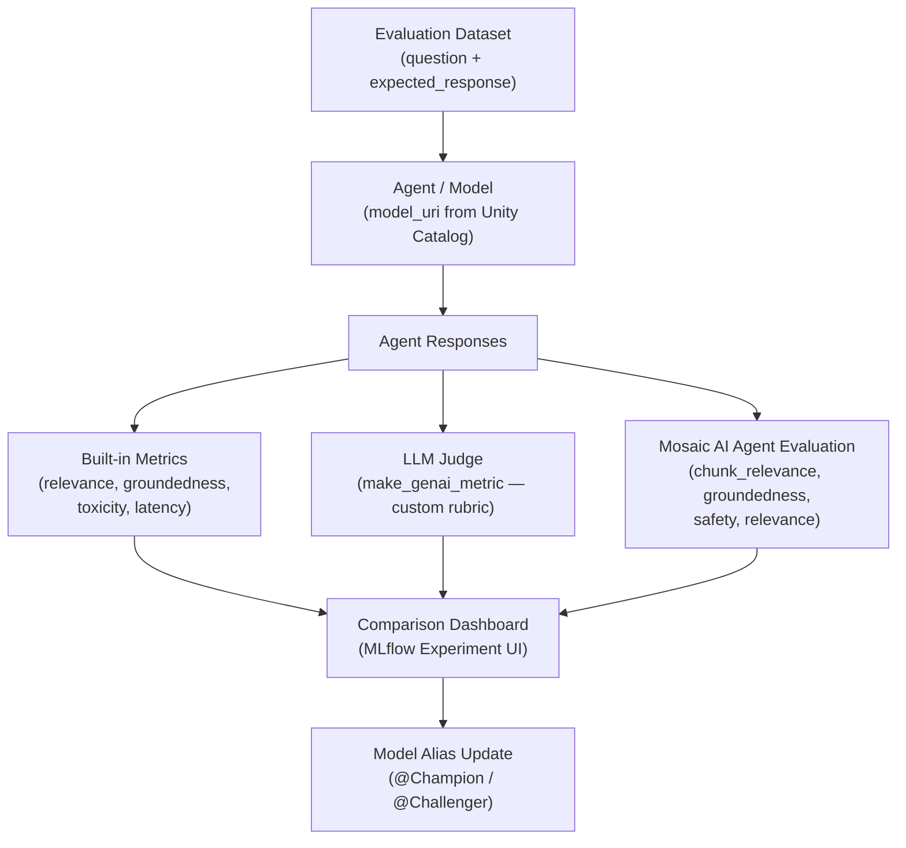

# Lab 08 Workbook: Evaluation & LLM-as-Judge

**Exam Domain:** Evaluation and Monitoring (12%)
**Time:** ~40 minutes | **Cost:** ~$2–3

---

## Architecture Diagram

---

## Time and Cost

| Resource | Estimated Cost |
|---|---|
| Databricks Serverless compute | ~$0.50 |
| LLM judge token usage (built-in metrics, 5 rows × 2 runs) | ~$0.50–1.00 |
| Custom citation judge (5 rows × judge LLM calls) | ~$0.50–1.00 |
| Mosaic AI Agent Evaluation (5 rows × 4 metrics) | ~$0.50–1.00 |
| **Total** | **~$2–3** |

> Costs scale linearly with eval dataset size. A 50-row dataset costs approximately 10× more for LLM-judge-based metrics. Token-count and latency metrics are free.

---

## What Was Done

### Step 1 — Create Evaluation Dataset

**What:** Built a pandas DataFrame with 5 rows covering transformer attention, LoRA, chain-of-thought prompting, RAG, and Constitutional AI. Each row has an `inputs` column (the user question) and an `expected_response` column (the ground-truth answer).

**Why:** Every evaluation framework in Databricks — `mlflow.evaluate`, `databricks.agents.evaluate`, and custom judges — requires an evaluation dataset as input. Without ground-truth expected responses, metrics such as groundedness and relevance cannot be computed automatically because there is no reference to compare against.

**Result:** A 5-row DataFrame ready to be passed directly to `mlflow.evaluate` and `databricks.agents.evaluate`. In production this dataset would be stored as a Delta table in Unity Catalog and versioned alongside the model.

**Exam tip:** The exam may ask what columns are **required** in an eval dataset. The minimum is `inputs`. Adding `expected_response` enables reference-based metrics (groundedness, relevance). Adding `retrieved_context` enables chunk-level metrics. Adding `trace` enables trace-based analysis.

---

### Step 2 — Built-in Metrics with `mlflow.evaluate`

**What:** Called `mlflow.evaluate(model=model_uri, data=eval_data, targets="expected_response", model_type="databricks-agent")`. MLflow automatically invoked a Databricks judge model to produce `relevance_to_query`, `groundedness`, and `toxicity` scores, plus latency and token counts.

**Why:** Built-in metrics give immediate, zero-config quality signal. Specifying `model_type="databricks-agent"` selects the Databricks-hosted judge model automatically — no judge URI required. This is the fastest way to establish a quality baseline and is sufficient for many use cases.

**Result:** An MLflow run containing aggregate metrics (mean, min, max per metric) and a per-row `eval_results` table viewable in the MLflow Experiment UI. The run is fully reproducible because the model URI is pinned to a specific version number.

**Exam tip:** `model_type="databricks-agent"` is the keyword that activates Databricks-specific judge behaviour. Using `model_type="question-answering"` instead would use a different, non-Databricks judge model. This distinction is frequently tested.

---

### Step 3 — Custom LLM Judge with `make_genai_metric`

**What:** Defined a `citation_quality` metric using `mlflow.metrics.genai.make_genai_metric`. The rubric scores responses 1–5 based on how precisely they cite sources (1 = no citations, 5 = every claim has a locatable reference). Added `EvaluationExample` few-shot anchors at scores 2 and 5 to calibrate the judge. Passed the custom metric to `mlflow.evaluate` via `extra_metrics=[citation_metric]`.

**Why:** Built-in metrics are domain-agnostic. A RAG system for academic research must be evaluated on citation quality — a dimension that no off-the-shelf metric measures. `make_genai_metric` is the standard mechanism for encoding domain expertise into an automated judge.

**Result:** Each eval row in the results table gains two new columns: `citation_quality/score` (1–5 integer) and `citation_quality/justification` (the judge's reasoning). The aggregate mean score is logged to the MLflow run.

**Exam tip:** `make_genai_metric` calls a *separate* judge model — not the model being evaluated. The judge model should be **more capable** (or at least equally capable) than the evaluated model to produce reliable scores. Using the evaluated model as its own judge produces inflated, unreliable scores.

---

### Step 4 — Mosaic AI Agent Evaluation

**What:** Imported `from databricks.agents import evaluate as agent_evaluate` and called it with `metrics=["relevance", "groundedness", "safety", "chunk_relevance"]`. This API is purpose-built for Databricks RAG agents and understands the agent's internal trace structure.

**Why:** `databricks.agents.evaluate` provides `chunk_relevance` — a metric that scores each retrieved chunk independently for relevance to the query. This uniquely targets the **retriever** component, not the generator. Standard `mlflow.evaluate` has no equivalent. Diagnosing whether a quality problem is in retrieval or generation is impossible without this metric.

**Result:** A richer per-row results table that includes retriever-level metrics alongside generator-level metrics. The `safety` metric flags any response that violates content policy. All results are logged to the MLflow experiment.

**Exam tip:** Know the retriever-vs-generator split: `chunk_relevance` = retriever quality; `groundedness` + `relevance` = generator quality. If `chunk_relevance` is low but `groundedness` is high, the retriever is returning off-topic chunks but the generator is staying faithful to them. If `chunk_relevance` is high but `groundedness` is low, the generator is hallucinating beyond the retrieved context.

---

### Step 5 — Compare Model Versions

**What:** Looped over `MODEL_VERSION in [1, 2]`, running `mlflow.evaluate` for each. Collected `metrics` dicts into a `comparison` dict keyed by version. Printed a side-by-side table of `relevance_to_query/mean`, `groundedness/mean`, `toxicity/ratio`, `latency/mean`, and `token_count/mean`. Selected the best version by `relevance_to_query/mean` and showed how to update the `@Champion` alias via the Databricks SDK.

**Why:** Evaluation only drives value when it informs a decision. Comparing versions and promoting the winner is the purpose of the entire evaluation pipeline. Doing this with code — rather than manual inspection — makes the process reproducible and auditable.

**Result:** A printed comparison table showing which version wins on each metric. The `@Champion` alias promotion code is shown but commented out so students can read and understand it before running it in their workspace.

**Exam tip:** Model aliases (`@Champion`, `@Challenger`) control which version is returned by `models:/name/@Champion`. Updating an alias does not delete any model version — it simply changes which version the alias resolves to. This is the recommended way to perform zero-downtime model promotions.

---

## Key Concepts

| Concept | Definition |
|---|---|
| **Evaluation Dataset** | A table of question/expected-response pairs that serves as ground truth for automated evaluation. Minimum columns: `inputs`. Add `expected_response` for reference-based metrics. |
| **Groundedness** | A metric (1–5) measuring whether every factual claim in the model's response is supported by the retrieved context. A grounded response does not add information beyond what the context contains. |
| **Relevance** | A metric (1–5) measuring whether the model's response actually answers the user's question. A relevant response is on-topic and complete. |
| **Chunk Relevance** | A retriever-level metric (unique to Mosaic AI Agent Evaluation) that scores each retrieved chunk for relevance to the query. Enables independent diagnosis of retriever quality. |
| **Safety** | A binary or scored metric that flags responses containing harmful, offensive, or policy-violating content. Returned by `databricks.agents.evaluate` as part of the standard metric suite. |
| **LLM-as-a-Judge** | A pattern where a second, typically more capable LLM is used to evaluate the output of the primary model. The judge model receives the question, the response, and a rubric, and returns a score with justification. |
| **Custom Rubric** | A grading prompt passed to `make_genai_metric` that maps observable response characteristics to integer scores on a defined scale (e.g. 1–5). Rubrics encode domain expertise that generic metrics cannot capture. |
| **`make_genai_metric`** | The MLflow function (`mlflow.metrics.genai.make_genai_metric`) used to create a custom LLM-as-a-Judge metric. Accepts a rubric, few-shot examples, and a judge model URI. |
| **Agent Evaluation** | The `databricks.agents.evaluate` API — a Databricks-specific evaluation framework that understands agent trace structure and provides retriever-level metrics not available in standard `mlflow.evaluate`. |

---

## Exam Practice Questions

**Q1.** A data scientist runs `mlflow.evaluate` on a RAG agent and observes that `groundedness/mean` is 4.8 but `relevance_to_query/mean` is 2.1. What does this combination most likely indicate?

- A) The retriever is returning irrelevant chunks; the generator is hallucinating.
- B) The generator is faithfully reproducing the retrieved context, but the retrieved context does not answer the user's question.
- C) The model is producing toxic outputs that are unrelated to the query.
- D) The evaluation dataset is too small to produce reliable metrics.

**Answer: B** — High groundedness means the generator is staying within the retrieved context (not hallucinating). Low relevance means the response does not answer the question. This indicates a retriever problem: the wrong chunks are being retrieved, so the generator has no relevant information to work with. The fix is to improve the retrieval layer (embedding model, chunking strategy, or vector search parameters), not the generator.

---

**Q2.** A developer wants to evaluate whether an LLM agent cites its sources precisely. None of the built-in `mlflow.evaluate` metrics measure citation quality. What is the correct approach?

- A) Write a custom Python function that parses the response for DOI patterns using regex.
- B) Use `mlflow.metrics.genai.make_genai_metric` with a rubric that defines citation criteria on a 1–5 scale.
- C) Switch to `databricks.agents.evaluate` and use the `chunk_relevance` metric.
- D) Use `mlflow.evaluate` with `model_type="question-answering"` and compare against the expected response.

**Answer: B** — `make_genai_metric` is the standard mechanism for creating domain-specific LLM-as-a-Judge metrics in MLflow. A rubric-based approach is more robust than regex (citation formats vary) and more cost-effective than a fully custom evaluation pipeline. Option A would miss non-DOI citations. Option C measures retriever quality, not citation quality. Option D produces similarity scores, not citation scores.

---

**Q3.** Which evaluation framework should be used to independently measure the quality of the *retriever* component in a Databricks RAG pipeline?

- A) `mlflow.evaluate` with `model_type="databricks-agent"` and the `groundedness` metric.
- B) `mlflow.evaluate` with `model_type="question-answering"` and the `answer_similarity` metric.
- C) `databricks.agents.evaluate` with the `chunk_relevance` metric.
- D) A custom `make_genai_metric` that scores retrieved chunks for topic relevance.

**Answer: C** — `chunk_relevance` is the only standard Databricks metric that scores retrieved chunks independently. It is available exclusively through `databricks.agents.evaluate` because that API understands the agent's trace structure (which chunks were retrieved per request). `groundedness` measures whether the *generator* stayed within the context — it does not tell you whether the context itself was relevant.

---

**Q4.** An evaluation dataset has 100 rows. A team is choosing a judge model for a custom `make_genai_metric`. Model A is the same model being evaluated. Model B is a larger, more capable model. Model C is a smaller, cheaper model. Which choice produces the most reliable scores?

- A) Model A — it understands its own output best.
- B) Model B — a more capable model produces more calibrated judgements.
- C) Model C — lower cost allows more evaluation runs.
- D) Any model can be used; the rubric quality matters more than the judge model.

**Answer: B** — The judge model should be equal to or more capable than the evaluated model. Using the evaluated model as its own judge (Model A) introduces a self-evaluation bias: the model tends to rate its own outputs highly regardless of actual quality. Model C would reduce cost but at the expense of judge calibration, especially for nuanced rubric dimensions. While rubric quality matters, judge model capability is also a critical factor.

---

**Q5.** A production MLflow experiment has two registered model versions. Version 1 has `relevance_to_query/mean = 3.8` and `latency/mean = 2.1s`. Version 2 has `relevance_to_query/mean = 4.2` and `latency/mean = 4.8s`. The team wants to promote the better version to `@Champion`. What is the correct Databricks SDK call, and what tradeoff must be considered?

- A) Call `w.registered_models.delete_version(version=1)` and register version 2 as the new version.
- B) Call `w.registered_models.set_alias(full_name=MODEL_NAME, alias="Champion", version_num=2)` and accept that latency doubles; verify SLA requirements are met.
- C) Call `mlflow.register_model` to create a new version combining both models.
- D) Update the `@Champion` alias to version 1 because lower latency is always preferred over higher relevance.

**Answer: B** — `set_alias` is the correct SDK method. Updating an alias is a non-destructive operation — version 1 is not deleted and can be rolled back instantly by re-pointing the alias. The tradeoff is real: version 2's relevance improvement (+0.4 points, ~10%) comes at a latency cost (+2.7s, ~130%). Whether this tradeoff is acceptable depends on the application's SLA. Option A is destructive and irreversible. Option C is not a valid MLflow operation. Option D prioritises a non-quality metric without justification.

---

## Cost Breakdown

| Component | Detail | Estimated Cost |
|---|---|---|
| Databricks Serverless compute | Notebook execution (~40 min DBU) | ~$0.50 |
| Built-in metrics (Section B) | 5 rows × judge model calls × 2 runs | ~$0.25–0.50 |
| Custom citation judge (Section C) | 5 rows × judge LLM calls (70B model) | ~$0.50–1.00 |
| Mosaic AI Agent Evaluation (Section D) | 5 rows × 4 metrics | ~$0.50–1.00 |
| Version comparison loop (Section E) | 5 rows × 2 versions × judge calls | ~$0.25–0.50 |
| **Total** | | **~$2–3** |

> The dominant cost driver is the LLM judge — specifically the citation judge (Section C) and Agent Evaluation (Section D), both of which call a 70B-parameter model per eval row per metric. Reducing the eval dataset to 5 rows (as in this lab) keeps costs manageable for learning. Production datasets of 50–200 rows will cost proportionally more.
