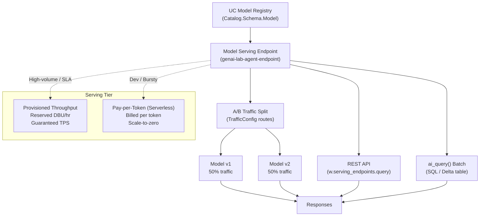

# Lab 09 Workbook: Deployment & Model Serving

**Exam Domain:** Assembling and Deploying Apps (22%)

---

## Architecture Diagram

---

## Time & Cost Estimate

| Item | Value |
|---|---|
| **Estimated time** | 45 minutes |
| **Estimated cost** | $3 – $5 |

See detailed breakdown in the [Cost Breakdown](#cost-breakdown) section below.

---

## What Was Done

### Step 1 — Deploy Serving Endpoint

**What:** Registered a Unity Catalog model (`genai_lab.default.rag_agent`, version 1) as a Databricks Model Serving endpoint using `WorkspaceClient.serving_endpoints.create_and_wait`.

**Why:** The serving endpoint provides a stable HTTP URL that clients call regardless of which model version is currently active. The SDK call is idempotent — the `already exists` guard prevents errors on re-runs.

**Result:** Endpoint `genai-lab-agent-endpoint` reaches `READY` state with `workload_size=Small` and `scale_to_zero_enabled=True`.

**Exam tip:** `create_and_wait` is a long-polling convenience method; the underlying REST call is `POST /api/2.0/serving-endpoints`. Know both for the exam.

---

### Step 2 — Test REST API

**What:** Sent a single inference request using `w.serving_endpoints.query` with `dataframe_records` format.

**Why:** Validates that the deployed model is reachable and returns well-formed predictions before wiring it into production systems.

**Result:** JSON response containing `predictions` (custom model) or `choices` (Foundation Model API) printed to the notebook output.

**Exam tip:** The `dataframe_records` format maps to the MLflow `pyfunc` serving input schema. Foundation Model API endpoints use the OpenAI-compatible `messages` format instead.

---

### Step 3 — A/B Testing (Traffic Split)

**What:** Updated the endpoint configuration with two `ServedEntityInput` objects (v1 and v2) and a `TrafficConfig` assigning 50% traffic to each.

**Why:** Allows side-by-side comparison of model versions under real production traffic without requiring client-side changes. Supports canary releases and quality evaluation.

**Result:** Both model versions receive equal traffic; `update_config_and_wait` blocks until the new config is live.

**Exam tip:** Traffic percentages across all routes must sum to exactly 100. The exam may present distractors where values sum to more or less than 100.

---

### Step 4 — Batch Inference with `ai_query()`

**What:** Created a Delta table `test_questions` with 5 rows and ran a SQL `SELECT` that calls `ai_query(endpoint, question)` for each row.

**Why:** `ai_query()` enables batch inference entirely in SQL — no Python driver code, no Spark UDFs. It integrates naturally into data pipelines and scheduled jobs.

**Result:** A result DataFrame with `id`, `question`, and `answer` columns, produced by the serving endpoint, displayed via `display()`.

**Exam tip:** `ai_query()` is available in Databricks SQL and notebooks. It requires the endpoint to be `READY`; it does not work against endpoints in a `UPDATING` state.

---

### Step 5 — Provisioned Throughput vs Pay-per-Token

**What:** Compared the two serving tiers for Foundation Model API endpoints: Provisioned Throughput (reserved DBU/hr) vs Pay-per-Token (serverless, billed per token).

**Why:** Choosing the wrong tier is a common and costly mistake. High-volume production workloads pay less per effective token with Provisioned Throughput despite higher fixed cost.

**Result:** Decision framework: use Pay-per-Token for dev/test/bursty traffic; use Provisioned Throughput for sustained production load with latency SLAs.

**Exam tip:** `scale_to_zero_enabled` is a property of **custom model** served entities, not Foundation Model API endpoints. The exam has tested this distinction.

---

## Key Concepts

| Concept | Definition |
|---|---|
| **Model Serving Endpoint** | A managed HTTP endpoint that wraps a registered ML model and handles scaling, routing, and versioning |
| **Scale to Zero** | When enabled, a served entity scales compute to zero replicas during idle periods to minimize cost; `scale_to_zero_enabled=True` in `ServedEntityInput` |
| **ServedEntityInput** | SDK class representing a single model version to be served; configures entity name, version, workload size, and traffic share |
| **A/B Testing (Traffic Split)** | Routing a percentage of incoming requests to different model versions via `TrafficConfig.routes`; percentages must sum to 100 |
| **`ai_query()`** | Built-in Databricks SQL function for calling a Model Serving endpoint row-by-row within a SQL query; enables SQL-native batch inference |
| **Provisioned Throughput** | A serving tier that reserves dedicated compute for Foundation Models; billed per DBU/hour regardless of token usage; guarantees tokens-per-second |
| **Pay-per-Token** | A serverless serving tier billed per input+output token; automatically scales; best for variable or low-volume traffic |

---

## Exam Questions

**Q1.** You call `w.serving_endpoints.create_and_wait` with `workload_size="Small"` and `scale_to_zero_enabled=True`. After the endpoint is `READY`, what happens if no requests arrive for 30 minutes?

- A) The endpoint is deleted automatically
- B) The served entity scales down to zero replicas, stopping compute billing
- C) The endpoint moves to a `DEGRADED` state
- D) Nothing — `scale_to_zero_enabled` only applies to Foundation Model API endpoints

**Answer: B.** Scale-to-zero reduces replicas to zero during inactivity, stopping compute cost without deleting the endpoint configuration.

---

**Q2.** A data engineer wants to enrich a Delta table with LLM-generated summaries as part of a scheduled SQL job. Which approach is most appropriate?

- A) Write a Python Spark UDF that calls `requests.post` for each row
- B) Use `ai_query()` in a SQL `SELECT` statement referencing the serving endpoint
- C) Export the table to CSV and call the endpoint locally
- D) Use `mlflow.pyfunc.load_model` and apply it with `DataFrame.map`

**Answer: B.** `ai_query()` is the SQL-native function designed for this use case and integrates with scheduled Databricks SQL jobs.

---

**Q3.** You configure an A/B test with three served entities. Entity A gets 40%, Entity B gets 40%, and Entity C gets 30%. What happens when you call `update_config_and_wait`?

- A) The call succeeds and excess traffic is dropped
- B) Traffic is normalized automatically to 100%
- C) The API returns a validation error because percentages sum to 110%
- D) Entity C receives 0% traffic as the excess is redistributed

**Answer: C.** Databricks validates that traffic percentages sum to exactly 100 and returns an error if they do not.

---

**Q4.** You use `ai_query('my-endpoint', input_col)` in a SQL query. The endpoint is currently in `UPDATING` state. What is the expected behavior?

- A) The query waits indefinitely until the endpoint becomes `READY`
- B) The query returns `NULL` for all rows
- C) The query fails with an error because the endpoint is not available
- D) The query routes requests to the previous configuration during the update

**Answer: C.** `ai_query()` requires the endpoint to be in `READY` state; requests to an `UPDATING` endpoint fail.

---

**Q5.** Your production chatbot handles 800 requests per minute consistently throughout business hours. You are evaluating Provisioned Throughput vs Pay-per-Token. Which statement best describes the cost trade-off?

- A) Pay-per-Token is always cheaper because you only pay for tokens used
- B) Provisioned Throughput has a higher per-DBU cost but lower effective per-token cost at sustained high volume
- C) The two options have identical cost at any volume
- D) Provisioned Throughput is only available for custom models, not Foundation Models

**Answer: B.** At sustained high request rates, the fixed DBU/hour cost of Provisioned Throughput amortizes to a lower effective per-token cost than pay-per-token billing.

---

## Cost Breakdown

| Resource | Estimated Cost |
|---|---|
| Databricks serverless compute (notebook runtime, ~45 min) | ~$0.50 |
| LLM token usage (test queries via endpoint) | ~$1.00 |
| Model Serving endpoint runtime (~45 min, Small workload size) | ~$2.00 |
| **Total** | **~$3.50 – $5.00** |

> Costs vary by region and DBU pricing tier. Use `scale_to_zero_enabled=True` and delete the endpoint after the lab to avoid ongoing charges.
